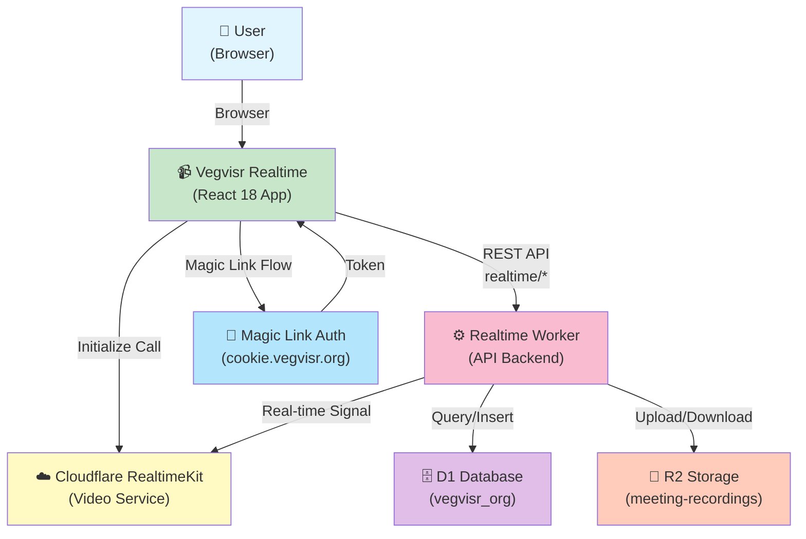
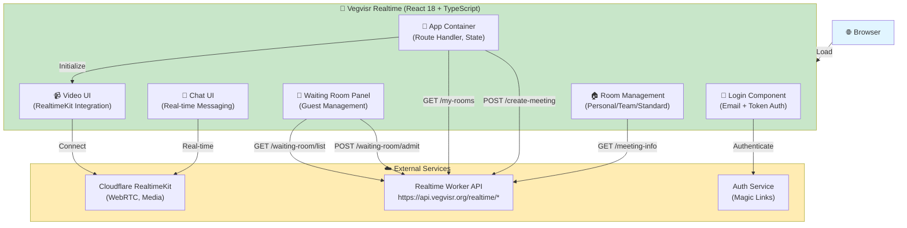

# Vegvisr Realtime

A real-time video meeting and communication platform built with React, TypeScript, and Cloudflare's RealtimeKit. Vegvisr Realtime provides a modern, collaborative meeting experience with features like waiting rooms, screen sharing, chat, and recording management.

## Features

- **Real-time Video Meetings** — Multi-participant video conferencing powered by Cloudflare RealtimeKit
- **Waiting Room** — Host-controlled guest admission system with database-backed persistence
- **Recording & Portfolio Management** — Record meetings, search and organize recordings, support for cloud storage (R2)
- **Meeting Invitations** — Share meetings via email invites with magic links
- **User Roles & Permissions** — Admin/Superadmin for meeting management, Realtime role for participants
- **Screen Sharing** — Built-in screen share toggle for presentations
- **Chat & Messaging** — Real-time text communication during meetings
- **Room Management** — Personal, team, and standard meeting rooms with customizable access

## Stack

- **Frontend:** React 18 + TypeScript
- **Build Tool:** Vite
- **Styling:** Tailwind CSS v3
- **UI Components:** Cloudflare RealtimeKit UI + vegvisr-ui-kit
- **Icons:** lucide-react
- **Animations:** motion
- **Authentication:** Email-based magic links with verification tokens

## Ecosystem Context

Vegvisr Realtime is a frontend client application in the Vegvisr ecosystem. It connects to the centralized backend (vegvisr-frontend) which provides all meeting management, storage, and infrastructure services.

### L1: System Context

Shows how vegvisr-realtime fits within the Vegvisr ecosystem and interacts with external systems.



### L2: Container Diagram

Shows the internal building blocks of vegvisr-realtime and its dependencies.



For full architecture details, see [C4 Architecture Diagrams](../../c4-diagrams/vegvisr-realtime-c4.md) in the ecosystem.

---

## Getting Started

### Prerequisites

- Node.js 16+ and npm
- `.env.local` file for local development (see [Dev Setup](#dev-setup))

### Installation

```bash
npm install
```

### Dev Setup

Create a `.env.local` file in the project root for dev-only auto-login:

```
VITE_DEV_USER_EMAIL=your-email@example.com
VITE_DEV_USER_TOKEN=<emailVerificationToken from D1>
VITE_DEV_USER_ROLE=admin
```

**Note:** `.env.local` is gitignored. Never commit credentials.

### Available Commands

| Command | Purpose |
|---------|---------|
| `npm run dev` | Start Vite dev server on port **3001** |
| `npm run build` | Run TypeScript check + Vite build |
| `npm run lint` | Run ESLint |
| `npm run preview` | Preview the production build |

## Project Structure

```
src/
├── components/
│   ├── Login.tsx              # Email/token-based login form
│   └── WaitingRoomPanel.tsx   # Host-controlled waiting room UI
├── lib/
│   └── auth.ts                # Authentication utilities
├── App.tsx                    # Main application component
└── main.tsx                   # Entry point
```

## Key Components

### App.tsx
The main application component that:
- Manages authentication context and user state
- Handles meeting setup and navigation
- Integrates RealtimeKit for video conferencing
- Manages room state (personal, team, standard rooms)
- Controls UI layout (setup screen, meeting, etc.)

### Login.tsx
User authentication component supporting:
- Email + token verification
- User registration via magic links
- Role-based UI adjustments

### WaitingRoomPanel.tsx
Waiting room management:
- Guest knock notifications
- Host admit/deny controls
- Draggable modal interface
- Database-backed guest persistence

## API Endpoints Used

- **Authentication:** Magic link verification and token validation
- **User Management:** DB validation on load, user auto-registration
- **Waiting Room:** Guest knock submission, host admit/deny actions
- **Recording:** Upload/transcribe cloud recordings, portfolio metadata
- **Meeting Rooms:** Fetch standard rooms, personal/team meeting IDs

## Development Notes

### Environment & Defaults
- Dev server runs on port **3001** (customizable via `npm run dev -- --port=XXXX`)
- Magic link base: `https://cookie.vegvisr.org`
- Dashboard base: `https://dashboard.vegvisr.org`
- Uses Cloudflare D1 for user validation and waiting room persistence

### Room Types
- **Personal:** Single meeting room per user (if assigned)
- **Team:** Shared team meeting room (if user belongs to team)
- **Standard:** Public/shared rooms with optional kind/title metadata

### Recording Features
- Multipart chunk upload for large files
- Cloud storage via Cloudflare R2
- Portfolio search and sorting
- Meeting owner metadata support
- Transcription support for cloud recordings

## Git Workflow

This project uses a continuous development model with frequent small commits. See recent commit history for examples of feature rollout patterns:
- Recording portfolio search (`228bc57`)
- Cloud recording transcription (`ec697da`)
- Multipart chunk upload (`9d22449`)
- Superadmin upload UI (`d413b39`)

## Contributing

- Follow the patterns established in existing components
- Run `npm run lint` before committing
- Update TypeScript types as you add features
- Test in the dev server on port 3001

## License

© Vegvisr. All rights reserved.

## Support

For questions or issues, check the Vegvisr documentation or contact the maintainers.
